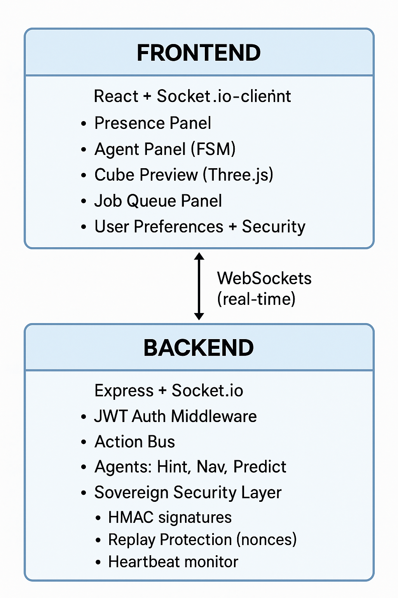
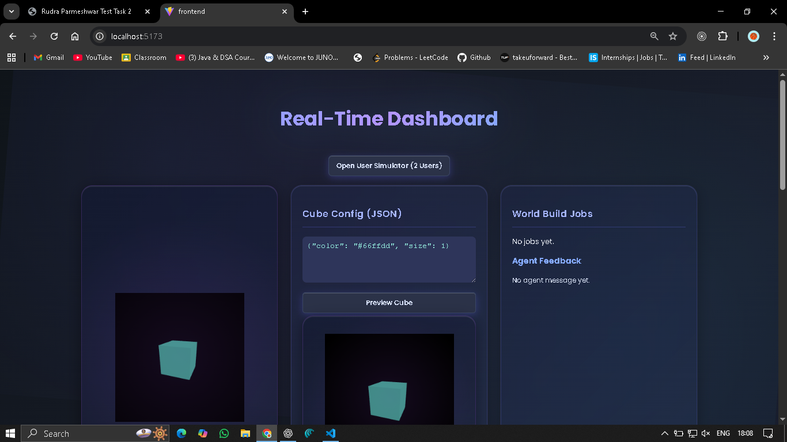

---
# **Real-Time Micro-Bridge + Multi-Agent Orchestrator Dashboard**

### **Sovereign-Core Security Prototype — Internship Technical Task (7-Day + 4-Day Combined)**

---

##   Table of Contents

* [Overview](#overview)
* [Features](#features)
* [System Architecture](#system-architecture)
* [Setup & Installation](#setup--installation)
* [Environment Variables](#environment-variables)
* [How to Use the Dashboard](#how-to-use-the-dashboard)
* [Security Checklist](#security-checklist)
* [What I Learned](#what-i-learned)
* [HHG Reflection](#hhg-reflection)

---

## **Overview**

This repository contains the complete implementation of **both internship technical tasks**:


## **Features**

### **Real-Time Features**

* Multi-user presence (active / idle / disconnected)
* Action bus with real-time logs
* Agent reactions & collisions (spam click → HintAgent priority)
* 3D Cube (Three.js) that updates on job finish
* Real-time job queue (build simulation)

### **Multi-Agent System**

* HintAgent (spam-detection → trigger hint)
* NavAgent (idle → trigger nav prompt)
* PredictAgent (pattern-based heuristics)
* RuleAgent (backup heuristic)
* Orchestrator with priority ordering
* Agent FSM visualization (Idle → Triggered → Cooldown)

### **Sovereign Security**

* JWT with issuer + expiry
* HMAC signatures for actions
* Per-agent key registration
* Nonce rotation per agent
* Anti-replay table
* Secure heartbeats
* Dashboard-level security indicators:

  * Signature failures
  * Replay alerts
  * Nonces
  * Heartbeats

### **UI Panels**

* Presence Panel
* Actions Panel
* Agent Status Panel (FSM)
* Job Queue Panel
* JSON Config Panel
* 3D Cube Preview
* **User Preferences Panel** (compact mode, sound, dark/light)
* Security Panel

---

## **System Architecture**

<p align="center">
  
</p>

For a detailed explanation of event flow, agent behavior, and security checkpoints, see:
- [`docs/architecture.md`](./docs/architecture.md)
- [`docs/handover_final.md`](./docs/handover_final.md)


---

## Setup & Installation

Detailed setup and run instructions are documented in:

- [`RUN.md`](./RUN.md)

Follow the steps there to start the backend and frontend services.
---


## **How to Use the Dashboard**

### **1. Presence**

Move/stop moving the mouse → active / idle updates automatically
Disconnect tab → disconnected state

### **2. Actions Panel**

Press “inspect”, “interact”, “spam click”, etc.
Watch agent reactions update in real time.

### **3. Agent Panel (FSM)**

Shows:

* state (Idle / Triggered / Cooldown)
* last reason
* last message
* timestamp
* cooldown bar

### **4. Job Queue + Cube Preview**

Submit “generate_world” jobs →
Queue processes →
Cube updates color/size on completion.

### **5. Security Panel**

Shows:

* signature validation results
* per-agent nonce
* replay alerts
* heartbeat status

### **6. User Preferences**

Toggle:

* compact mode
* dark/light
* sound

Preferences persist via localStorage.

---

## **Security Checklist**

### **Core Security**

✔ JWT validation (issuer + expiry)
✔ HMAC signatures for actions
✔ Per-agent key registration
✔ Anti-replay nonce table
✔ Reject expired timestamps
✔ Heartbeat validation

### **Transport**

✔ WebSocket handshake auth
✔ Origin-restricted CORS

---

## **What I Learned**

* How to build a real-time system end-to-end (frontend + backend)
* Designing multi-agent orchestration with clear priorities
* Implementing JWT + HMAC + nonce security without breaking real-time flows
* Structuring state for multi-user + multi-agent isolation
* Three.js integration with real-time UI
* Building a professional dashboard with modular components
* Improving debugging discipline using structured logs
* Engine integration with secure Socket.IO communication
* Job queue management with retry logic and failure handling
* Real-time telemetry and monitoring systems

---

## **HHG Reflection**

For detailed reflection on the development process, challenges faced, and lessons learned, see:
- [`docs/HHG_reflection_final.md`](./docs/HHG_reflection_final.md)
- [`docs/hhg_reflcetion.md`](./docs/hhg_reflcetion.md)

---

## **Documentation**

### Core Documentation
- [`RUN.md`](./RUN.md) - Setup and installation guide
- [`docs/architecture.md`](./docs/architecture.md) - System architecture details
- [`docs/handover_final.md`](./docs/handover_final.md) - Complete handover documentation
- [`docs/security_readiness.md`](./docs/security_readiness.md) - Security implementation details

### Engine Integration
- [`docs/engine_adapter.md`](./docs/engine_adapter.md) - Engine adapter documentation
- [`docs/engine_security.md`](./docs/engine_security.md) - Engine security protocols
- [`docs/job_lifecycle.md`](./docs/job_lifecycle.md) - Job processing lifecycle

### Testing & Validation
- [`docs/TESTING_GUIDE.md`](./docs/TESTING_GUIDE.md) - Comprehensive testing guide
- [`docs/failure_simulation_report.md`](./docs/failure_simulation_report.md) - Failure handling tests
- [`docs/stress_test_report.md`](./docs/stress_test_report.md) - Performance testing results

### Additional Resources
- [`docs/demo_mode.md`](./docs/demo_mode.md) - Demo mode usage guide
- [`docs/telemetry_coverage.md`](./docs/telemetry_coverage.md) - Telemetry system documentation
- [`system_audit.md`](./system_audit.md) - System audit report

---

## **Repository Structure**

```
Real-Time-Micro-Bridge/
├── backend/                 # Node.js backend server
│   ├── agents/             # Multi-agent system (Hint, Nav, Predict, Rule)
│   ├── auth/               # JWT & signature authentication
│   ├── engine/             # Game engine integration layer
│   ├── orchestrator/       # Multi-agent orchestrator
│   ├── security/           # Nonce, heartbeat, replay protection
│   ├── telemetry/          # Behaviour tracking & analytics
│   └── index.js            # Server entry point
├── frontend/               # React + Vite frontend
│   ├── src/
│   │   ├── components/     # Dashboard panels & UI components
│   │   ├── hooks/          # Custom React hooks
│   │   ├── socket/         # Socket.IO client
│   │   └── state/          # State management
│   └── package.json
├── docs/                   # Comprehensive documentation
├── Screenshots/            # Dashboard screenshots
├── Videos/                 # Demo videos
├── start.bat              # Windows startup script
├── start.sh               # Unix/Linux startup script
├── README.md              # This file
└── RUN.md                 # Quick start guide
```

---

## **Tech Stack**

### Backend
- **Node.js** - Runtime environment
- **Express.js** - HTTP server
- **Socket.IO** - Real-time WebSocket communication
- **MongoDB** - Database for telemetry and events
- **JWT** - Authentication tokens
- **CryptoJS** - HMAC signatures and encryption

### Frontend
- **React** - UI framework
- **Vite** - Build tool and dev server
- **Tailwind CSS** - Styling framework
- **Three.js** - 3D cube preview
- **Socket.IO Client** - Real-time communication

---

## **Key Features Implemented**

### Security Layer
- ✅ JWT-based authentication with role-based access
- ✅ HMAC-SHA256 signatures for all actions
- ✅ Per-agent cryptographic key registration
- ✅ Nonce-based replay attack prevention
- ✅ Timestamp validation (±30s window)
- ✅ Heartbeat monitoring for engine liveness
- ✅ Origin-restricted CORS policies

### Multi-Agent System
- ✅ HintAgent - Spam detection and user hints
- ✅ NavAgent - Idle detection and navigation prompts
- ✅ PredictAgent - Pattern-based predictions
- ✅ RuleAgent - Fallback rule-based logic
- ✅ Priority-based orchestration
- ✅ FSM state management (Idle → Triggered → Cooldown)
- ✅ Agent collision handling

### Engine Integration
- ✅ Secure Socket.IO namespace (`/engine`)
- ✅ Job queue with retry logic
- ✅ Real-time telemetry streaming
- ✅ Graceful disconnect/reconnect handling
- ✅ Job lifecycle tracking (queued → dispatched → running → completed)
- ✅ Progress updates and error reporting

### Dashboard Features
- ✅ Real-time presence tracking (active/idle/disconnected)
- ✅ Action log with categorization
- ✅ Agent status panel with FSM visualization
- ✅ Job queue panel with status indicators
- ✅ 3D cube preview with Three.js
- ✅ JSON config editor for world generation
- ✅ Security panel (admin only)
- ✅ User preferences (dark mode, compact mode)
- ✅ Demo mode for quick testing
- ✅ Multi-user simulator

---

## **Quick Start**

### One-Command Setup

**Windows:**
```bash
start.bat
```

**Mac/Linux:**
```bash
chmod +x start.sh
./start.sh
```

This will:
1. Install all dependencies
2. Create environment files
3. Start backend (port 3000)
4. Start frontend (port 5173)
5. Open dashboard in browser

For detailed setup instructions, see [`RUN.md`](./RUN.md).

---

## **Testing**

### Run Tests
```bash
# Backend tests
cd backend
node test_single_job.js          # Single job execution
node test_concurrent_jobs.js     # Concurrent job handling
node test_engine_disconnect.js   # Disconnect recovery
node test_mock_engine_secure.js  # Full integration test

# Security tests
node test_engine_security_live.js

# Failure simulation
node test_failures.js
```

### Health Check
```bash
curl http://localhost:3000/health
```

---

## **Screenshots**

<p align="center">
  
  <br/>
  <em>Main Dashboard with all panels</em>
</p>

<p align="center">
  
  <br/>
  <em>Agent Status Panel showing FSM states</em>
</p>

<p align="center">
  
  <br/>
  <em>Job Queue with real-time status updates</em>
</p>

More screenshots available in the [`Screenshots/`](./Screenshots/) directory.

---

## **Demo Videos**

Demo videos showcasing the system in action:
- [`Videos/demo_final.mp4`](./Videos/demo_final.mp4) - Complete system demo
- [`Videos/demo_job_queue.mp4`](./Videos/demo_job_queue.mp4) - Job queue processing
- [`Videos/overall_demo.mp4`](./Videos/overall_demo.mp4) - Full feature walkthrough

---

## **Contributing**

This is an internship project for TTG . For questions or issues:

1. Check the documentation in [`docs/`](./docs/)
2. Review [`RUN.md`](./RUN.md) for setup issues
3. See [`docs/TESTING_GUIDE.md`](./docs/TESTING_GUIDE.md) for testing procedures

---


**Repository:** [https://github.com/Rudra212545/Real-time-Dashboard](https://github.com/Rudra212545/Real-time-Dashboard)


